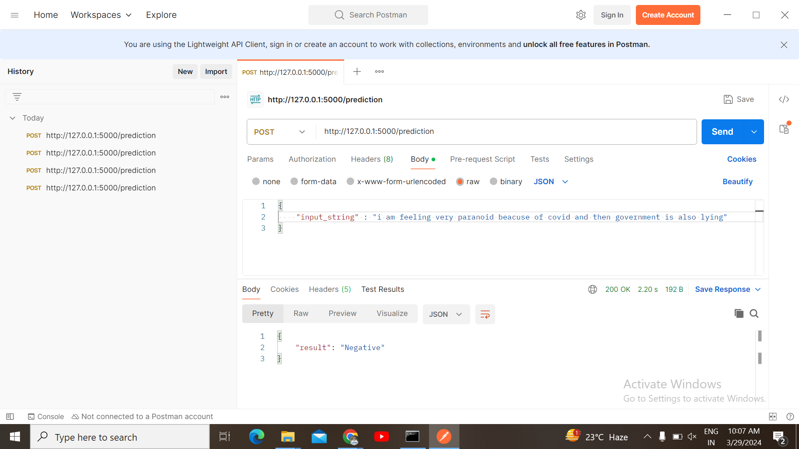

# Flask Endpoint of sentiment analysis of twitter reviews

This Flask endpoint accepts any text string as input and determines whether it is positive or negative. The model powering this endpoint has been trained on a dataset containing over 50,000 rows of text data.


  
## Run Locally

Clone the project

```bash
  git clone https://github.com/Hunny-001/Sentiment_analysis.git
```

Go to the project directory

```bash
  cd Sentiment_analysis
```

Install dependencies

```bash
  install -r requirements.txt
```

Run main file

```bash
  python app.py
```

  
## Screenshots
Output Image




  
